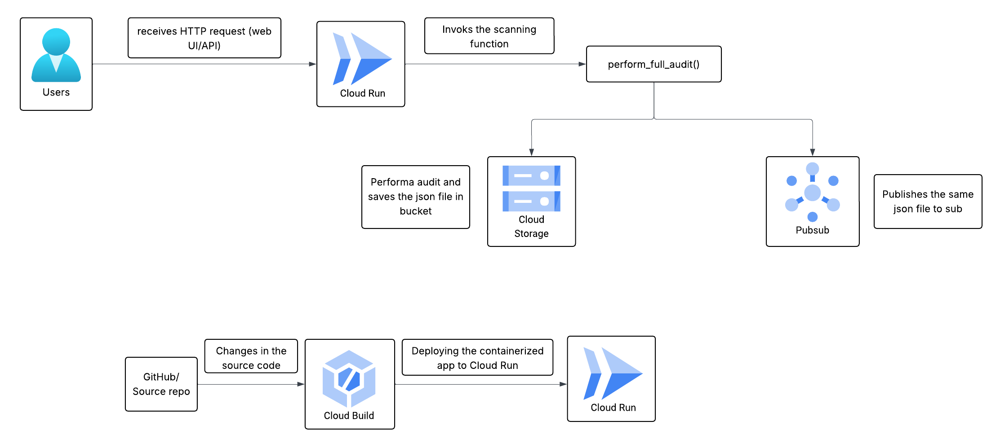
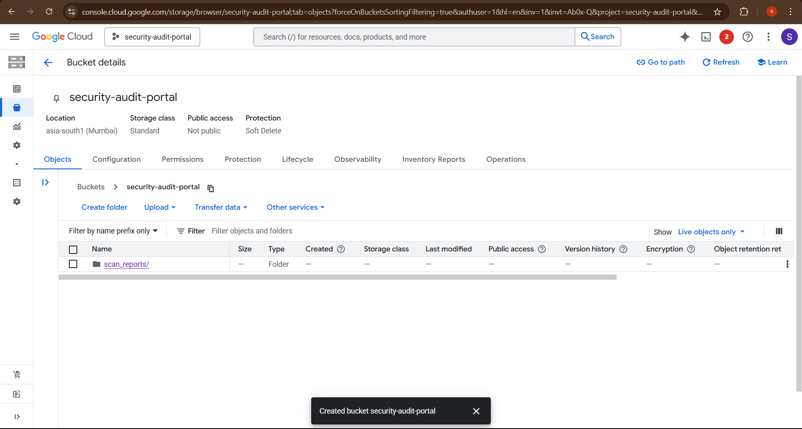
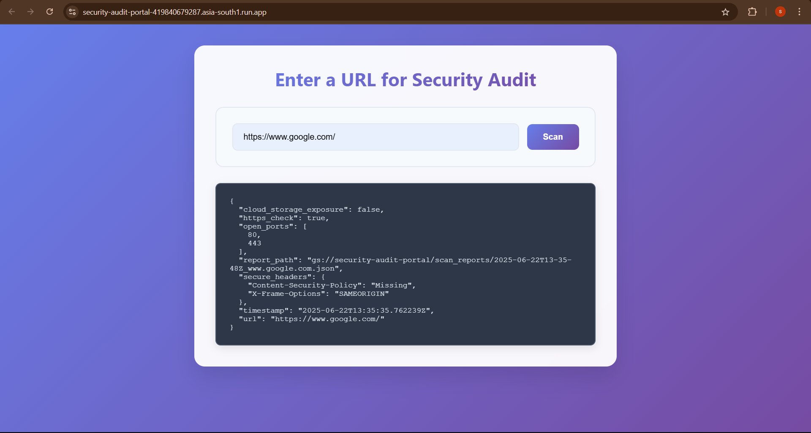
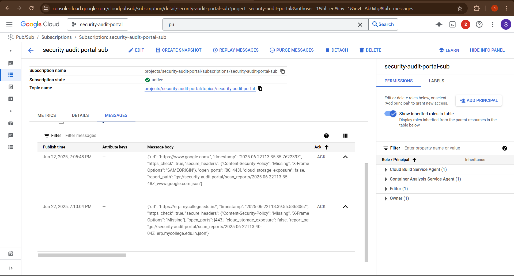
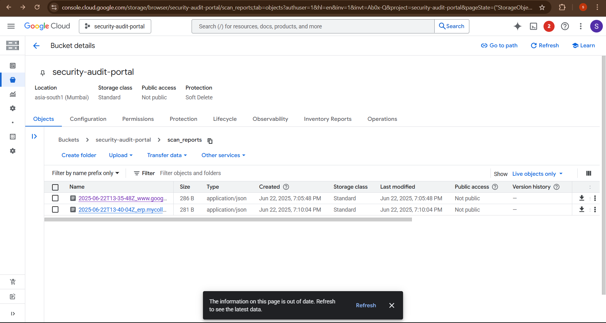
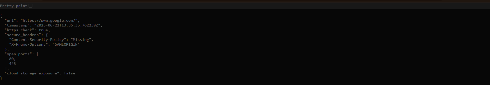

# 🔐 Security Audit Portal

A simple yet powerful web-based security auditing tool that allows users to perform a basic security scan of any publicly accessible website. It provides a real-time report and stores audit results on Google Cloud for persistent logging and optional asynchronous processing.

---

## 📌 Project Overview

This project enables users to:

* ✅ Enter any website URL via a clean web UI
* ✅ Perform security checks such as:

  * HTTPS enforcement
  * Missing security headers
  * Open common ports
  * Cloud storage exposure
* ✅ View the audit report directly in the browser
* ✅ Save the full scan report in Google Cloud Storage
* ✅ (Optional) Trigger a Pub/Sub event with the scan result for downstream processing

Built using:

* Python Flask
* HTML/CSS/JS frontend
* Docker
* Google Cloud Platform (Cloud Run, Storage, Pub/Sub)

---

## 🚀 Features

| Feature                     | Description                                   |
| --------------------------- | --------------------------------------------- |
| 🌐 Web UI                   | Clean, mobile-friendly frontend               |
| 🔍 Security Scanner         | Scans HTTPS, headers, open ports, cloud links |
| 📟 Real-Time JSON Reports   | Output shown directly on the webpage          |
| ☁️ Google Cloud Integration | Stores JSON audit logs to Cloud Storage       |
| 📩 GCP Pub/Sub              | Publishes audit metadata to a topic           |
| 📦 Containerized            | Deployed via Docker on Cloud Run              |

---

## 🌐 Live Demo

> Once deployed, your Cloud Run public URL will look like this:
> `https://security-audit-portal-419840679287.asia-south1.run.app`

---

## 🏗️ GCP Architecture (How GCP Works in This Project)

This project uses **Google Cloud Platform** services to make the app serverless, scalable, and event-driven.

### 🔹 Cloud Run (Service: `security-audit-portal`)

* Hosts the containerized Flask application
* Handles HTTP requests from the web frontend
* Scales automatically (0 → N) based on traffic

### 🔹 Cloud Storage (Bucket: `security-audit-portal`)

* Stores scan reports as `.json` files
* Files include timestamp, URL, and scan results
* Files are named like:

  ```
  scan_reports/2025-06-22T13-14-31Z_example.com.json
  ```

### 🔹 Pub/Sub (Topic: `security-audit-portal`)

* Publishes a message with scan metadata
* Useful for triggering notifications, BigQuery ingestion, or external workflows

### 🔹 Cloud Build

* Automatically builds Docker containers from GitHub commits (if connected)
* Deploys the image to Cloud Run

---

## 📈 Architecture Diagram

Below is a visual representation of how GCP services interact in this project:



---

## ⚙️ Local Development

To run locally:

```bash
# Install dependencies
pip install -r requirements.txt

# Run the Flask app
python app.py
```

Or using Docker:

```bash
docker build -t security-audit-portal .
docker run -p 8080:8080 security-audit-portal
```

## 🖥️ Output

Below images shows how the object files are stored in GCP and how the output appears on web 

### This is where the reports of scans are stored


### This is how the result will appear on the web


### This is the pub/sub message in GCP after scan


### This is how the object files (scan reports) are stored in buckets


### This is how the object files looks like when open


---

## 📟 Sample JSON Report

```json
{
  "url": "https://example.com",
  "timestamp": "2025-06-22T13:14:31Z",
  "https_check": true,
  "secure_headers": {
    "Content-Security-Policy": "Missing",
    "X-Frame-Options": "SAMEORIGIN"
  },
  "open_ports": [80, 443],
  "cloud_storage_exposure": false,
  "report_path": "gs://security-audit-portal/scan_reports/2025-06-22T13-14-31Z_example.com.json"
}
```

## 🛠️ Tech Stack

* Python 3.10
* Flask
* Requests
* Google Cloud SDKs:
  * `google-cloud-run`
  * `google-cloud-build`
  * `google-cloud-storage`
  * `google-cloud-pubsub`
* HTML/CSS (Vanilla)
* Docker

---

## 🧪 Future Improvements

* Email the report to user
* Add screenshot capture using headless Chrome
* Scan for known vulnerabilities (CVEs)
* Downloadable PDF reports
* Admin dashboard with scan history

---
